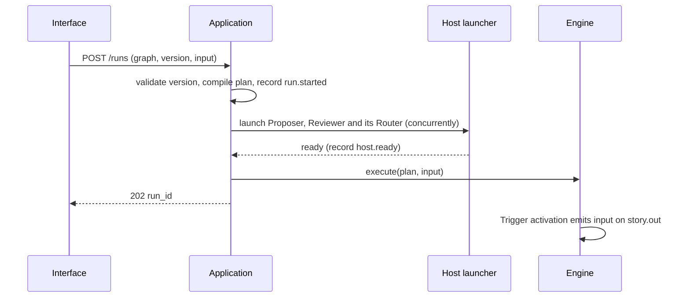
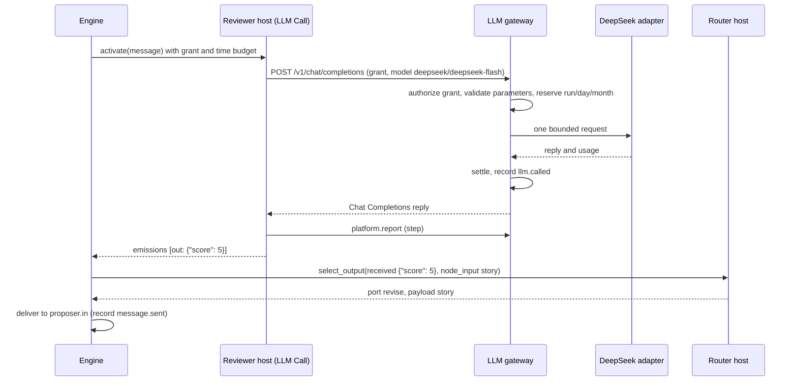

# Runtime scenarios

The scenarios follow journey J3, [funny story with review](../contracts/examples/funny-story-with-review.graph.json).

## Save a version

1. The editor sends the document to `POST /graphs/validate` while the user edits and
   shows the diagnostics on the affected nodes and dialog sections.
2. Save sends `POST /graphs/{id}/versions`. The application validates again, stores
   version *n* and returns its number. Nothing else changes.

## Start a run

## Activation with an embedded Router

## Loop and completion

The `revise` delivery starts Proposer's second activation, whose output starts
Reviewer's second activation. When the Router selects `accepted`, the Output
activation records `run.result`. The queue is empty and nothing is running, so the
engine records `run.finished` with status `completed`, and the application stops the
hosts.

## Activation limit

If every review returns `revise`, the eleventh activation would exceed
`max_activations` = 10. The engine refuses to start it, cancels running
activations, records the pending delivery as dropped and finishes with status
`stopped` and reason `activation_limit`.

## Budget denial

If a reservation would exceed a budget, the gateway answers `402 budget_exhausted`,
asks the application to stop the run with that scope, and the LLM Call activation
fails. The run finishes `stopped` with `budget_run`, `budget_day` or `budget_month`.
