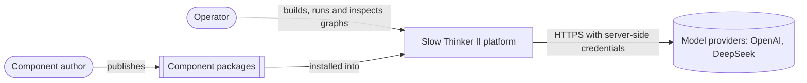
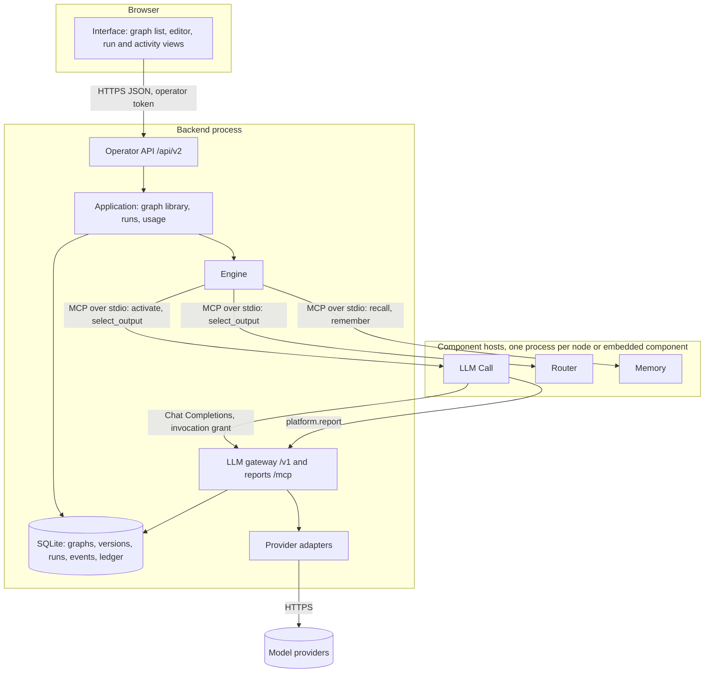
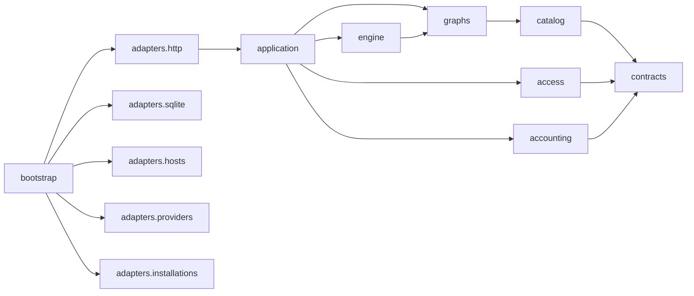

# Context and container views

## System context

## Containers

The platform is the only participant that holds credentials and the only path
between participants. Trigger and Output nodes run inside the backend.

## Components of the backend

Adapters implement ports defined by `application` and `engine`; arrows show import
direction. The [module boundaries](module-boundaries.md) enforce it.
