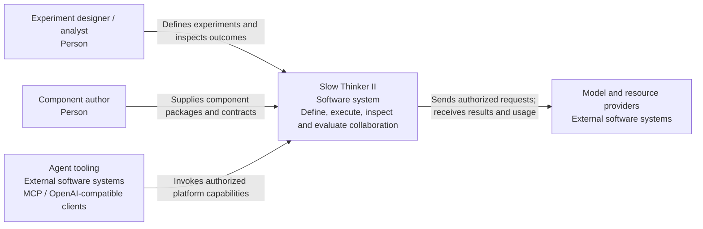
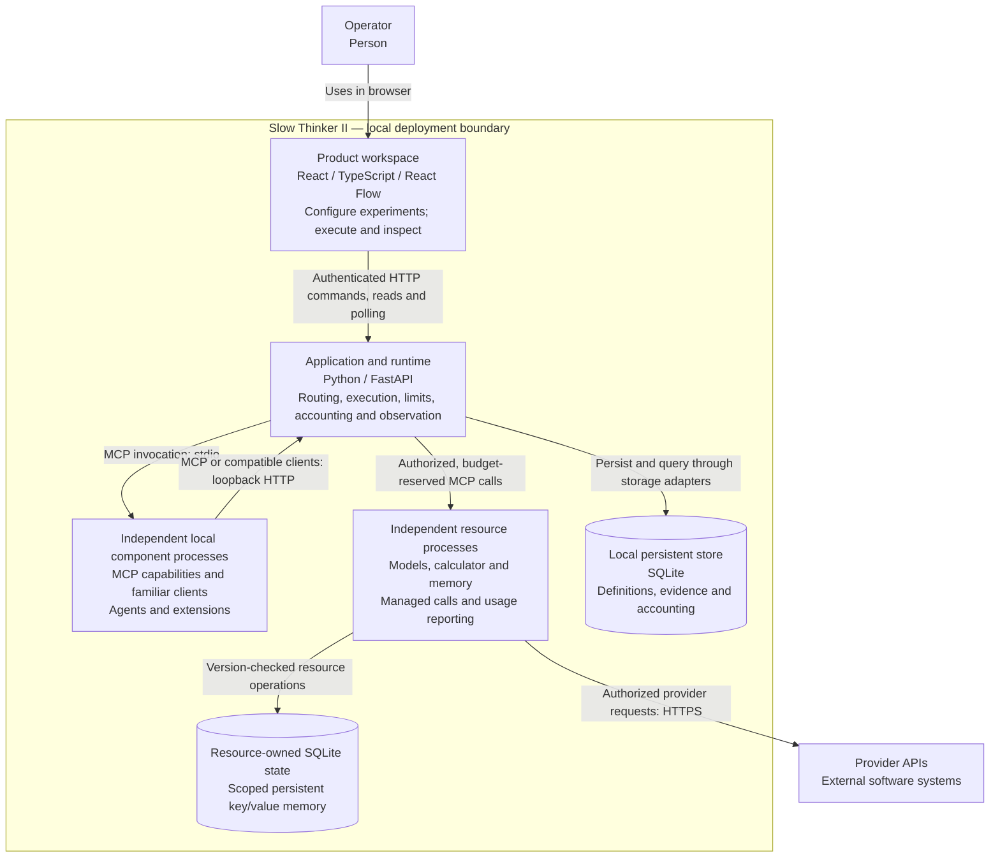

# C4 views

**Status: Local implementation view through S06.** These diagrams use [C4 abstractions](https://c4model.com/diagrams) rendered with Mermaid. Each view identifies people, software systems or containers, responsibilities, and relationships. A C4 container is a runnable application or data store, not necessarily a Docker container. Evaluation remains a future system capability.

## System context

Provider APIs are external boundaries. The original Slow Thinker remains independent, with no runtime or accounting integration. Budgets cover only managed Slow Thinker II calls (Q12). The diagram does not assert that external clients support every platform capability.

## Containers: initial local deployment

## View constraints

- Independent local component processes use the implemented hosting/MCP profile. This view does not define source-module boundaries.
- The runtime serves the compiled browser application; a separate production Node backend is not required.
- Provider resources receive platform-authorized calls and return results and usage. Their external I/O belongs to the managed adapter boundary and must be instrumented for accounting. It does not grant agent processes direct provider access.
- Component-to-platform calls use their own client transport. They must not assume an MCP server can initiate arbitrary reverse requests on the platform's connection.
- Compatible client requests enter the runtime's adapters and shared admission controls before MCP dispatch to a component. Familiar call syntax does not grant direct access to another process or external provider.
- Credentials and trace payloads are outside the diagram; their lifecycle is covered by the [security view](security.md).
- The local boundary is a deployment scope, not a malicious-code sandbox.

## Review questions

Independent-process packaging is recorded in [ADR 0004](../adr/0004-component-packaging.md).
The [MCP contract](../contracts/mcp-profile.md) and compatibility contracts define
the two transport directions. The [verification record](../verification.md)
retains observed conformance and persistence limits. Detailed source boundaries
belong in the [module view](module-boundaries.md); future deployment and execution
profiles remain in the [question register](../specification/open-questions.md).
