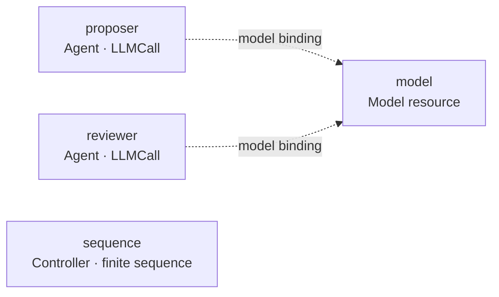
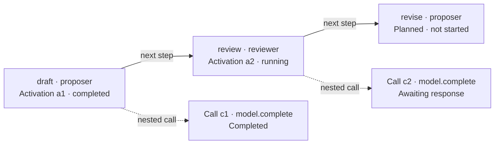

# Visual model

**Status: Recorded presentation requirements with proposed first-cycle interaction model.** References: R17–R19, QA12–QA13, QA27. Schematics below are review illustrations, not screenshots or evidence of an implemented UI.

## Required from the first functional cycle

The application must offer the [bundled graph examples](../contracts/examples/README.md), display the selected graph before execution, update execution state while it runs, and support inspection after completion. An editing tool and manual JSON upload are later capabilities.

| View | Identity and content |
| --- | --- |
| Structure | Configured participants, resources, control/collaboration components, permissions and bindings. |
| Execution | Actual activations and their status, inputs, outputs, duration, calls and costs. |
| Inspector | Details of the selected object, recorded evidence, errors and available reported reasoning. |

The [observation contract](../contracts/observation.md) supplies the proposed evidence model. The inspector distinguishes missing/redacted/deleted content from empty values, shows late responses without rewriting terminal outcomes, and separates settled costs from outstanding obligations. Budget labels identify the Slow Thinker II scope and monthly calendar policy.

Two activations of one agent retain the same participant identity. A graph-shaped proposal is inspected as agent output, not substituted for the orchestration graph.

## Relationship layers

Permitted communication, configured control flow, actual communications, and later inferred influence must be distinguishable and independently filterable. An allowed connection does not prove that a message was sent. A message does not prove that its contents caused a later change.

Agents, resources, and control components need distinct visual identities and text labels. Status must not depend on color alone. Selecting an activation should expose its participant and graph revision.

## Initial sequence projection

The sequence profile projects the selected example's ordered nodes. The review-cycle example yields draft, review, revise, with proposer, reviewer, proposer as participants. The other examples contain one, two or five activations; the view must derive these from the definition. Managed model access appears as a resource relationship and as actual calls when executed.

The controller's semantic configuration is separate from its visual projection. A future controller extension must supply a supported generic projection or a versioned renderer; executable behavior cannot depend on node screen positions.

### Example: the same graph in two views

The [review-cycle definition](../contracts/examples/review-cycle.graph.json) contains four configured instances: two agents, one model resource and one controller. A structure view displays each instance once. This sketch shows the resource-binding layer; selecting the permission layer instead shows the allowed `complete` operations. Both are declarations, not observed calls.

The execution view has separate scheduled uses of proposer for `draft` and `revise`. Before a node starts, its card is a planned step with no activation ID. On activation, the card gains the actual identity and evidence; the graph definition is unchanged. The following mid-run state is illustrative:

The two model-call cards reference the same model instance. Selecting either opens its own request, response and charge. They do not create extra model instances or graph steps. The `next step` edges express configured control order; they do not imply a direct call from proposer to reviewer. All managed calls still pass through the platform. The controller's recorded `next` calls remain available in the call list and inspector, outside the agent-step chain.

The input-binding layer is separate: `draft./value` supplies both review and revise; `review./value` also supplies revise. Selecting revise must show those two actual source references and the original problem. Labels and inspectors must not imply that every earlier response is automatically included.

## Proposed screen composition

Use one workspace with two view tabs, **Structure** and **Execution**, and one selection inspector. Before starting, show Structure with the selected example and a planned Execution view available. After admission, select Execution while preserving access to Structure. A new run must not replace the definition or history of the previous run.

| Area | First-cycle contents and behavior |
| --- | --- |
| Session/run navigation | Select or create a saved session, select one of the four examples, and open a completed run. History navigation is disabled during active execution in this first profile. |
| Run controls | Separate task input, effective model/limits summary, Start and Stop. Freeze inputs after admission. Stop is available during startup and execution and shows a pending state until acknowledged. |
| Run summary | Run outcome, elapsed time, Slow Thinker II costs/reservations, remaining budgets, and separate cleanup/settlement status. Provider credentials never appear. |
| Graph workspace | Structure/Execution tabs, explicit relationship-layer controls, pan/zoom, fit, and Reorganize. No component editing, upload or drag-to-connect in this cycle. |
| Selection inspector | Summary, input/output, nested calls, exposed internal reports and errors for the selected identity. Fetch large details on demand; show missing/redacted content explicitly. |
| Call list | Filterable by participant/activation, including controller/model calls and rejection; the list remains usable when many edges would clutter the canvas. |

Starting requires a valid input and a resolved configuration. Validation failures identify the field/component and keep Start unavailable; they do not create a partially running graph. A second Start while admission is pending must not create another run. A rejected or uncertain Start response is resolved through its request identity and saved run state, never by blindly repeating the command.

The [operator API proposal](../contracts/operator-api.md) makes this concrete: durable command receipts, duplicate suppression in backend transactions, command lookup after a lost reply and explicit withdrawal of an unconfirmed Start. Withdrawal prevents late admission when the run has not started; otherwise it applies the ordinary stop policy and retains incurred costs.

## Identity and selection rules

Structure selection uses component instance identity; execution selection uses activation identity, with a separate planned-node selection before activation. Call and attempt selections have their own identities. Do not key runtime cards by component name alone. The initial sequence maps at most one activation to each node; later looping profiles must support multiple activations without changing this identity model.

Selecting an agent in Structure shows its configured type/version, bindings, permissions and recorded activations. Selecting an activation shows only that invocation's effective inputs, outputs and nested calls. A link navigates to its participant or originating node; changing views does not silently substitute another activation of the same participant.

Structured outputs use a generic JSON inspector; text uses a plain text inspector. A graph-shaped result remains output content in this cycle. No result-specific renderer or automatic influence edge is inferred from its JSON shape. Unknown extension roles retain their labels and a generic component presentation; lack of a custom renderer does not justify hiding a supported component.

## Layout and interaction

Preserve positions while the view remains legible. Reorganize when new content or overlap makes inspection inconvenient; simple full reflow is acceptable initially. Layout state is saved separately from the domain graph and does not create a semantic experiment variant.

Status or cost updates never trigger reflow. Newly visible cards first use free space; if that fails, reorganize while retaining the selected identity and making the selected card reachable. Fit and Reorganize are separate actions. User panning/selection must not be repeatedly overridden by a live update. Collapsing a call group changes visibility only; it cannot discard its evidence or hide unresolved costs from totals.

Labels, status text and keyboard-accessible selection supplement color and geometry. Provide the same core inspection path through the call/activation list, so overlapping edges or pointer-only canvas interaction do not make evidence inaccessible. Numeric viewport, scale and response-time targets remain Q18.

Initial interaction consists of selecting a bundled example and a saved work session, viewing its graph, starting, observing, stopping, and inspecting completed history. Editing tools, manual JSON upload, pause, live editing, and browsing an earlier time point while execution continues are later features.

## Proposed live-update behavior

Recommend periodic same-origin HTTP reads of an authoritative run projection for the first cycle; commands remain explicit authenticated requests. Keep the read boundary replaceable so SSE or WebSocket delivery can be added later without changing graph/component identities or the inspector model. The initial view must not require a frontend event-sourcing engine.

The backend returns a consistent projection with run ID, graph revision and last included durable event sequence. Its opaque view token also covers shared budgets and every other returned field: an unchanged event sequence alone does not prove that the view is unchanged. Poll only the selected active run, with at most one request outstanding per view; unchanged projections may return no body. Fetch selected payloads separately with bounds and pagination. Discard replies from an obsolete selection/connection generation; a lower sequence on reconnect requires recovery handling instead of overwriting newer state.

On a connection failure, preserve the last view, mark it stale and reconnect using reads. Do not mark the backend run failed or finished merely because the browser disconnected. Disable new Start while active-run status is unknown; a Stop request must report whether it was acknowledged or remains uncertain. Reconnection obtains the authoritative projection and cannot execute or replay component calls.

After terminal execution, continue bounded refresh while cleanup or charges remain outstanding; a terminal outcome is not a claim that every bill is settled. The refresh interval, retry/backoff bounds and stale threshold need Q18 values. These are proposed application semantics, not claims about measured UI latency or a configured transport.

## Open design work

The [register](../specification/open-questions.md) tracks approval of this interaction model, polling and operator API proposals, numeric visual limits, machine-readable wire schemas and extension renderer registration. The form of later editing tools remains to be specified. QA12–QA13 and QA27 must verify the four example journeys, identity preservation, layer distinctions, reflow and reconnection. This document does not claim a UI prototype exists.
