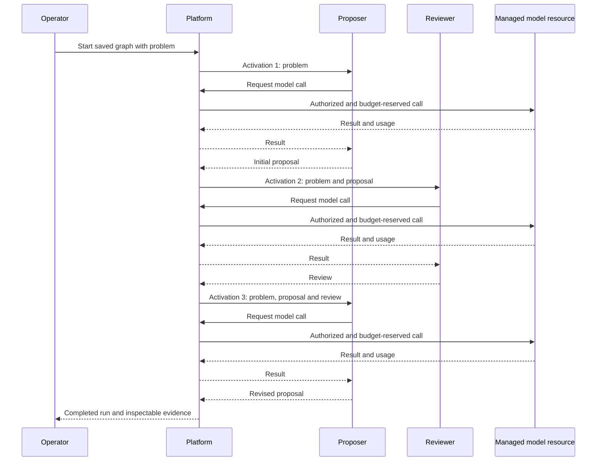
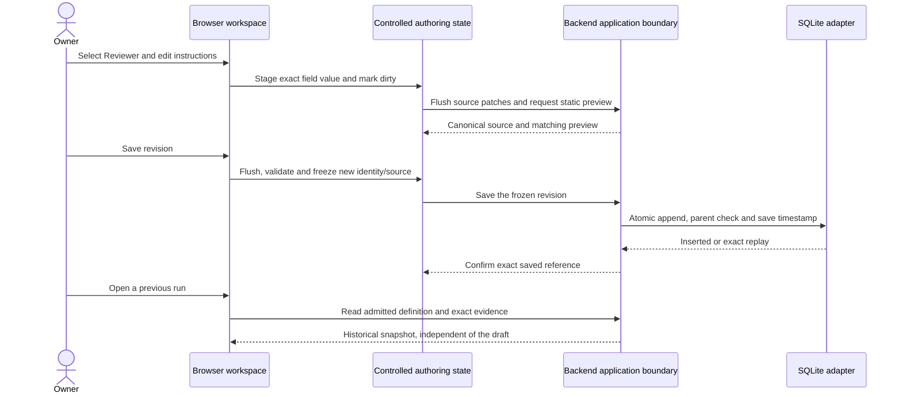

# Runtime scenarios

**Status: Proposed behavior for review**, derived from R01, R05–R16 and R18–R20. State names and ordering are not yet approved wire contracts.

Detailed [component lifecycle](../contracts/component-lifecycle.md), [call authority](../contracts/call-authority.md) and [run transitions](../contracts/execution.md#transition-and-race-policy) specify the proposed operational rules behind these scenarios.

## Validate and start

### S03 authoring and saved revision selection

1. Load exact definition text or import UTF-8 JSON. A manual draft changes only
   identity and lineage on the backend; it does not reserve or save a revision.
2. Validate structure, registered descriptors, supported profiles and static
   bindings without starting components or making provider calls.
3. Save canonical content atomically. Identical replay confirms the existing
   revision; different content at the same identity fails without overwriting it.
4. Refresh the bounded library and select the confirmed identity. If a reply is
   uncertain, retry the identical content; if listing fails, retain confirmation
   and recover selection separately. Unsaved drafts cannot start a run.

The [authoring contract](../contracts/personal-experiments.md) is authoritative for
this extension. It does not change run admission, accounting or retained evidence.

### Run admission

1. Resolve a saved work session and a graph revision.
2. Validate structure, component availability, supported execution profile, input references, permissions, and effective limits.
3. Freeze the graph, component versions/configurations, input, and pricing references for this run. Reject invalid or unsupported definitions before side effects.
4. Persist admission and its command receipt together, then expose the run in the UI. Reserve costs before individual billable dispatches. The [operator API](../contracts/operator-api.md) proposes duplicate suppression, lost-reply lookup and withdrawal of an uncertain Start.

Configuration validity does not authorize arbitrary network calls or grant all capabilities advertised by a component.

## Proposal, review, revision

Each arrow crossing a managed boundary is recorded with caller and causal identifiers. Model usage is charged once at the billable leaf; aggregate activation and run totals reference those charges. Trace recording does not add unrequested content to an agent's input.

## Nested requests

While awaiting an agent response, the platform must remain able to serve that agent's authorized model/resource calls. Holding a global execution lock while waiting would deadlock this scenario. One active workflow must not be implemented as a prohibition on nested calls.

This requirement includes calls made with familiar clients inside independent component processes. Client configuration or a compatible adapter directs each call to the platform; the platform validates caller authority and parent-activation correlation before admission and MCP dispatch. A synchronous model invocation inside a worker must not block the orchestrator from servicing that invocation. Supported request and response shapes are specified in the [compatibility proposal](../contracts/mcp-profile.md#familiar-client-interfaces).

## Budget rejection

Atomic reservation checks cover run, saved session, and month. A rejected reservation does not dispatch the call. It triggers a stop request for the whole run. Already dispatched work may still report usage; unsettled reservations remain visible. Starting a new run cannot erase existing obligations.

## Deadline or operator stop

Stop scheduling new work, request cancellation on active calls, and record the reason. Use transport-appropriate cancellation without assuming immediate termination. Completed or late charge evidence can settle accounting without restarting graph execution. The proposed transition table separates terminal outcome, process cleanup and settlement; cancellation/cleanup periods remain configurable, with numeric defaults still open.

## Failure and retries

An unhandled activation failure stops the initial executor. A component may handle a nested failure internally within its declared policy. Every retry is a new billable attempt where applicable, linked to the original logical operation. Retries require configuration; ambiguous external side effects must not be repeated automatically.

## Restart

Closing the browser leaves the backend running. A backend restart marks unfinished runs interrupted and preserves evidence and unsettled spending. It must not replay paid calls automatically. [ADR 0011](../../../adr/0011-local-persistence.md) proposes concrete crash boundaries: release an unsent reservation only when dispatch was never authorized; retain obligations after ambiguous dispatch; never infer non-execution from a missing response. Storage selection and reconciliation approval remain in the [open questions](../specification/open-questions.md).

## S06-UX authoring and historical inspection target

The [workspace state contract](../contracts/workspace-frontend-interfaces.md) adds
this browser/application scenario without changing managed execution:

The final reads use existing operator query ports; the API lifeline does not imply
an import from the library into the execution service. Lost save replies retain
the frozen source for recovery. Presentation metadata, preview, version browsing
and comparison cannot launch components or reserve cost.
